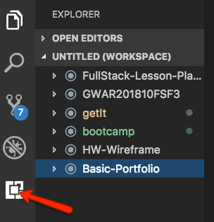
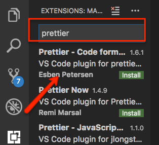
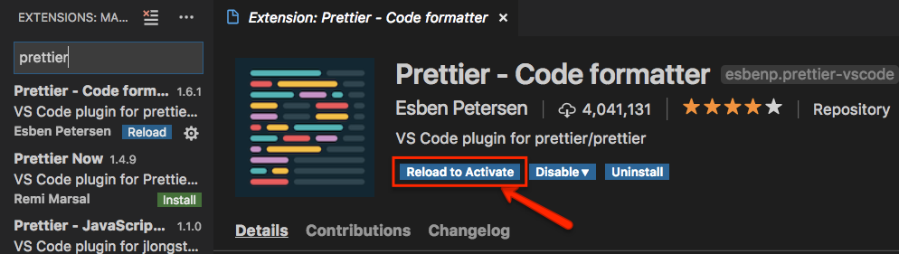
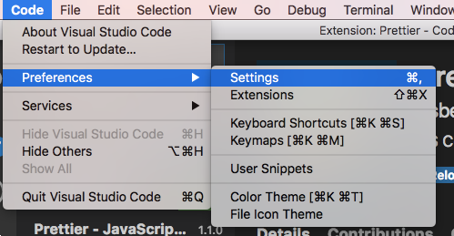
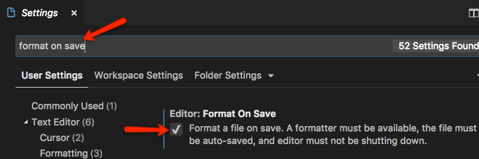

# Adding Prettier extension to VS Code

## What is Prettier?

[Prettier](https://prettier.io/) is a code formatter. It removes all original styling and ensures that all outputted code conforms to a consistent style.

- You press save and code is formatted
- No need to discuss style in code review
- Saves you time and energy
- Can be used in VS Code, Atom, Sublime and other editors

## Instructions for VS Code

1. Click the extensions menu icon located at the left side of the application.

2. The **Extensions Menu** opens. In the search box, type **prettier**. A list of extensions show up. Prettier is first. Click on the green **Install** button.

   

3. After it installs, you will see to the right that there is a button to reload VS Code, which activates the plugin (it won't work until you reload VS Code). Click **Reload to Activate**.

   

4. Next we need to set in our Settings to format on save. With this enabled, Prettier will run every time you save the file and will automatically format the code for you.

   Go to **Code** > **Preferences** > **Settings** in Mac (Windows will be slightly different).

   

5. Type **format on save** in the search input and hit **enter** key on the keyboard to search. The option **Editor: Format on Save** should show up first in the results list. Select the checkbox to activate this setting.

6. Now just code and save your file, and your code will format automatically.
